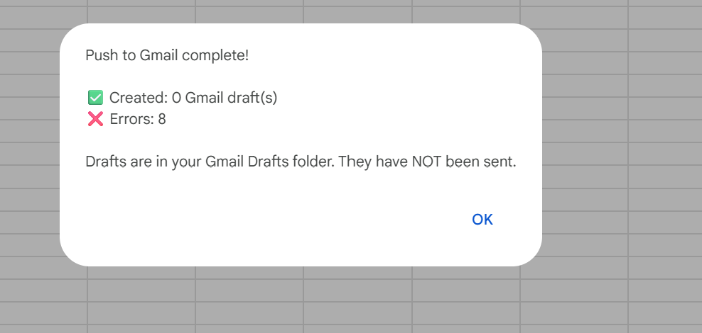
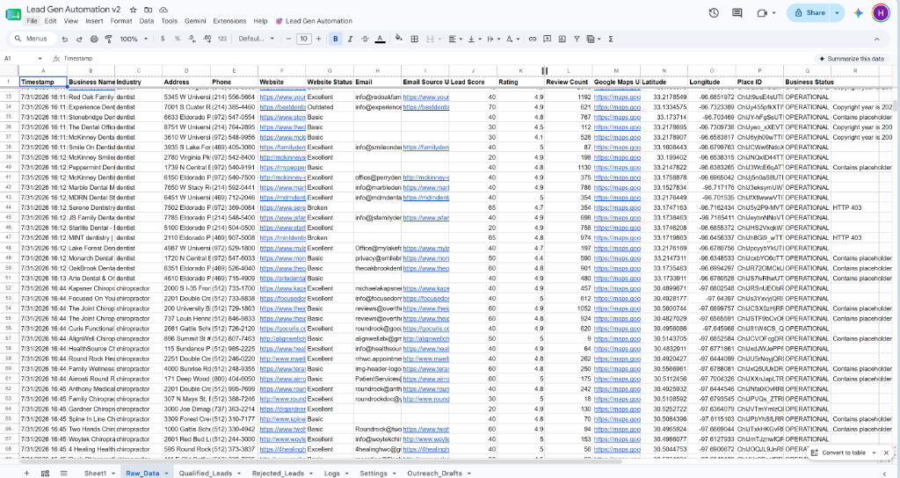
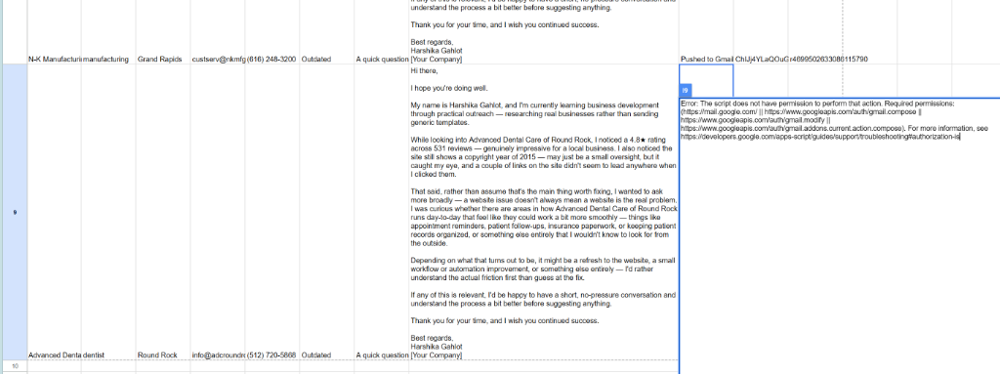
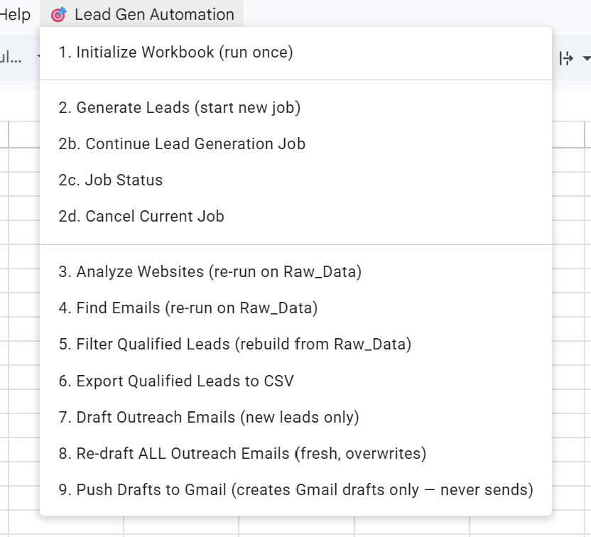
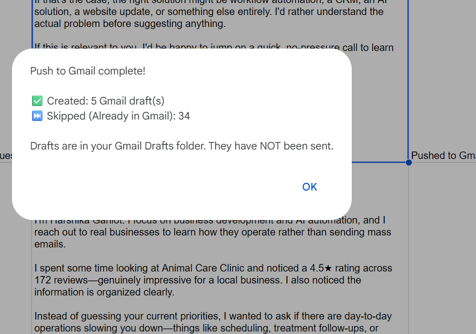

# AI Lead Generation & Outreach Automation Platform

[](https://developers.google.com/apps-script)
[](LICENSE)
[](#)

*An automated, serverless B2B prospecting engine that discovers local businesses, researches their online presence, qualifies leads, and generates highly personalized outreach drafts directly inside Google Workspace.*

## Table of Contents
- [Why I Built This](#why-i-built-this)
- [Solution Overview](#solution-overview)
- [Key Features](#key-features)
- [High-Level Workflow](#high-level-workflow)
- [Business Impact](#business-impact)
- [Challenges Solved](#challenges-solved)
- [What I Learned](#what-i-learned)
- [Demo](#demo)
- [Screenshots](#screenshots)
- [Technologies Used](#technologies-used)
- [Installation Guide](#installation-guide)
- [Contact Information](#contact-information)

## Why I Built This
I built this project after realizing how repetitive manual prospecting had become while learning business development. Researching businesses, checking websites, finding public emails, qualifying leads, and writing personalized outreach consumed significant time. 

I automated that workflow inside Google Workspace. Although it started as a personal productivity tool, the same workflow naturally applies to freelancers, agencies, consultants, startups, and B2B sales teams. The platform handles the heavy lifting, but the user always reviews the final, highly personalized Gmail drafts before a single email is ever sent.

## Solution Overview
Operating natively within Google Sheets and Google Apps Script, the system orchestrates the entire top-of-funnel sales pipeline. It intelligently discovers businesses, evaluates their digital footprint, extracts public contact information, applies strict qualification filters, and leverages AI to draft consultative, problem-first outreach emails. 

## Key Features
- **AI-assisted Business Discovery**
- **Website Intelligence**
- **Public Contact Discovery**
- **Smart Lead Qualification**
- **Personalized Outreach Generation**
- **Gmail Draft Automation**
- **Duplicate Prevention**
- **Batch Processing & Resume Support**

## High-Level Workflow

```text
       Google Maps API
              ↓
      Business Discovery
              ↓
     Website Intelligence
              ↓
    Public Email Discovery
              ↓
      Lead Qualification
              ↓
Personalized Outreach Generation
              ↓
        Google Sheets
              ↓
         Gmail Drafts
```

## Business Impact
- **Primary Use Case**: Automating the grueling process of manual lead discovery and data entry.
- **Who Could Use It**: Freelancers, agencies, consultants, startups, and B2B sales teams.
- **What it Automates**: Researching businesses, checking websites, finding public emails, qualifying leads, and drafting personalized outreach.
- **How it Improves Productivity**: Empowers users to spend their time actually speaking with qualified prospects rather than doing administrative research, while ensuring every outreach attempt is highly personalized, factual, and consultative rather than a generic mass-email blast.

## Challenges Solved
- **Google Apps Script Execution Limits**: Implemented robust resume/batch processing to stay safely under Google's 6-minute execution limits for long-running jobs.
- **Batch Processing**: Engineered a resilient background worker system to continuously process large lists of discovered leads.
- **Duplicate Prevention**: Built mechanisms to ensure businesses are never processed twice and duplicate drafts are never created.
- **Public Email Validation**: Designed strict filters to reject malformed emails, placeholder templates, and internal tracking addresses.
- **Gmail Draft Synchronization**: Synchronized spreadsheet records directly with the Gmail API safely and securely.
- **API Integrations**: Seamlessly connected Google Maps, Gmail, and Google Sheets without external servers.

## What I Learned
- **API Integrations**: Deepening my understanding of RESTful connections and rate limiting.
- **Google Apps Script (V8)**: Leveraging a serverless ecosystem for business automation.
- **Workflow Automation**: Orchestrating complex, multi-step asynchronous data pipelines.
- **AI-assisted Business Processes**: Using deterministic personalization logic to simulate high-touch human research.
- **Data Validation**: Sanitizing and structuring messy, real-world web data.
- **Performance Optimization**: Managing timeouts, payload sizes, and execution efficiency in constrained environments.
- **Building Consultative B2B Solutions**: Engineering tools that respect the end-user's workflow and focus on delivering business value.

## Demo

Watch the project in action:

[**View the Live Demo on YouTube 🎥**](https://youtu.be/Qqnz0f8JtKs)

## Screenshots

### Main Menu


### Raw Data Sheet


### Qualified Leads Sheet


### Personalized Gmail Draft


### Push to Gmail Result


## Technologies Used
- **Google Apps Script (V8 Runtime)**
- **Google Sheets (Data Storage & UI)**
- **Google Places API (New)**
- **Gmail API**
- **Google Drive API**
- **Clasp (CLI Management)**

## Installation Guide

### Prerequisites
- Node.js (v16.x or newer)
- A Google account with access to Google Sheets and Gmail

### Setup
1. **Install Clasp:**
   ```bash
   npm install -g @google/clasp
   ```
2. **Login & Clone:**
   ```bash
   clasp login
   git clone https://github.com/harshikagahlot/ai-lead-generation-outreach-platform.git
   cd ai-lead-generation-outreach-platform
   ```
3. **Connect to Apps Script:**
   Create a new Google Sheet, open **Extensions > Apps Script**, and copy your Script ID from **Project Settings**. Update `.clasp.json` with your Script ID.
4. **Deploy:**
   ```bash
   clasp push
   ```
5. **Run:**
   Refresh your Google Sheet, use the new **Lead Generator > Initialize Workbook** menu, enter your API key in the generated Settings tab, and start generating leads!

## Contact Information
- **Name**: Harshika Gahlot
- **Email**: harshikagahlot01@gmail.com
- **GitHub**: [https://github.com/harshikagahlot](https://github.com/harshikagahlot)
- **LinkedIn**: [TODO: Add LinkedIn Profile URL]
